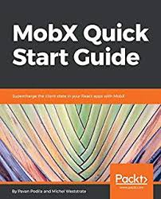

# MobX

_Простое и масштабируемое управление состоянием_

[](https://travis-ci.org/mobxjs/mobx)
[](https://coveralls.io/github/mobxjs/mobx?branch=master)
[](https://gitter.im/mobxjs/mobx?utm_source=badge&utm_medium=badge&utm_campaign=pr-badge&utm_content=badge)
[](https://hashnode.com/n/mobx)
[](#backers)
[](#sponsors)
[](https://github.com/prettier/prettier)

MobX спонсируется Mendix, Coinbase, Facebook Open Source и многими [другими спонсорами](#backers)

  

# Установка

* Установка: `npm install mobx --save`. Привязки для React: `npm install mobx-react --save`. Чтобы включить декораторы (необязательно), посмотрите раздел ниже.
* CDN:
- https://unpkg.com/mobx/lib/mobx.umd.js
- https://cdnjs.com/libraries/mobx

# Поддержка браузерами

* MobX >= 5 работает в любом браузере с [поддержкой прокси ES6](https://kangax.github.io/compat-table/es6/#test-Proxy). Это приведет к ошибке при запуске в более старых окружениях, таких как IE11, Node.js <6 или React Native Android на старом JavaScriptCore ([как обновить](https://github.com/react-community/jsc-android-buildscripts#how-to-use-it-with-my-react-native-app)).
* MobX 4 работает в любом браузере ES5 и будет активно поддерживаться. API MobX 4 и 5 одинаковы и семантически могут достичь того же, но MobX 4 имеет некоторые [ограничения](#mobx-4-vs-mobx-5).
  _Tip: главная точка входа пакета MobX 5 поставляется с кодом ES5 для обратной совместимости со всеми инструментами сборки. Но так как MobX 5 работает только в современных браузерах, рассмотрите возможность использования более быстрой и меньшей по размеру ES6-сборки: `lib / mobx.es6.js`. Например, установив псевдоним webpack: `resolve: { alias: { mobx: __dirname + "/node_modules/mobx/lib/mobx.es6.js" }}`_

## Переводы

* [中文](http://cn.mobx.js.org)

## Начало работы

* <i><a style="color: white; background:green;padding:5px;margin:5px;border-radius:2px" href="https://egghead.io/courses/manage-complex-state-in-react-apps-with-mobx">egghead.io course</a></i>
* [Ten minute, interactive MobX + React tutorial](https://mobxjs.github.io/mobx/getting-started.html)
*  [The MobX book](https://books.google.nl/books?id=ALFmDwAAQBAJ&pg=PP1&lpg=PP1&dq=michel+weststrate+mobx+quick+start+guide:+supercharge+the+client+state+in+your+react+apps+with+mobx&source=bl&ots=D460fxti0F&sig=ivDGTxsPNwlOjLHrpKF1nweZFl8&hl=nl&sa=X&ved=2ahUKEwiwl8XO--ncAhWPmbQKHWOYBqIQ6AEwAnoECAkQAQ#v=onepage&q=michel%20weststrate%20mobx%20quick%20start%20guide%3A%20supercharge%20the%20client%20state%20in%20your%20react%20apps%20with%20mobx&f=false) by Pavan Podila and Michel Weststrate (which despite it's name is in-depth!)
* [Official MobX 4 documentation and API overview](https://mobxjs.github.io/mobx/refguide/api.html) ([MobX 3](https://github.com/mobxjs/mobx/blob/54557dc319b04e92e31cb87427bef194ec1c549c/docs/refguide/api.md), [MobX 2](https://github.com/mobxjs/mobx/blob/7c9e7c86e0c6ead141bb0539d33143d0e1f576dd/docs/refguide/api.md))
* Videos:
  * [ReactNext 2016: Real World MobX](https://www.youtube.com/watch?v=Aws40KOx90U) - 40m [slides](https://docs.google.com/presentation/d/1DrI6Hc2xIPTLBkfNH8YczOcPXQTOaCIcDESdyVfG_bE/edit?usp=sharing)
  * [Practical React with MobX](https://www.youtube.com/watch?v=XGwuM_u7UeQ). In depth introduction and explanation to MobX and React by Matt Ruby on OpenSourceNorth (ES5 only) - 42m.
  * LearnCode.academy MobX tutorial [Part I: MobX + React is AWESOME (7m)](https://www.youtube.com/watch?v=_q50BXqkAfI) [Part II: Computed Values and Nested/Referenced Observables (12m.)](https://www.youtube.com/watch?v=nYvNqKrl69s)
  * [Screencast: intro to MobX](https://www.youtube.com/watch?v=K8dr8BMU7-8) - 8m
  * [Talk: State Management Is Easy, React Amsterdam 2016 conf](https://www.youtube.com/watch?v=ApmSsu3qnf0&feature=youtu.be) ([slides](https://speakerdeck.com/mweststrate/state-management-is-easy-introduction-to-mobx))
* [Boilerplates and related projects](http://mobxjs.github.io/mobx/faq/boilerplates.html)
* More tutorials, blogs, videos, and other helpful resources can be found on the [MobX awesome list](https://github.com/mobxjs/awesome-mobx#awesome-mobx)


## Введение

MobX — это библиотека, делающая управление состоянием приложения простым и масштабируемым, применяя функционально-реактивное программирование.
Философия MobX очень проста:

_“Все, что может быть получено из состояния приложения, должно быть получено. Автоматически”._

которое включает в себя пользовательский интерфейс, сериализацию данных, подключение к сервером и т.д.


React и Mobx вместе — мощная комбинация. React отрисовывает состояние приложения, предоставляя механизмы для перевода его в дерево отображаемых компонентов. MobX предоставляет механизм хранения и обновления состояния приложения, которое затем может использовать React.

Как React, так и MobX предоставляют оптимальное решение общих проблем разработки приложений. React даёт нам возможность оптимально отрисовывать интерфейс с помощью виртуалльного DOM, уменьшающего количество дорогостоящих изменений оригинального DOM. MobX позволяет синхронизировать состояние приложения между React-компонентами, используя графическое состояние реактивной виртуальной зависимости, которое обновляется только когда это действительно нужно.

Both React and MobX provide very optimal and unique solutions to common problems in application development. React provides mechanisms to optimally render UI by using a virtual DOM that reduces the number of costly DOM mutations. MobX provides mechanisms to optimally synchronize application state with your React components by using a reactive virtual dependency state graph that is only updated when strictly needed and is never stale.

## Основные конпцепции

У MobX лишь несколько основных концепций. Следующие фрагменты кода можно попробовать онлайн, используя [codesandbox](https://codesandbox.io/s/v3v0my2370).

### Наблюдаемое состояние

<i><details>     <summary style="color: white; background:green;padding:5px;margin:5px;border-radius:2px">egghead.io lesson 1: observable & observer</summary>     <br>     <div style="padding:5px;">         <iframe style="border: none;" width=760 height=427  src="https://egghead.io/lessons/javascript-sync-the-ui-with-the-app-state-using-mobx-observable-and-observer-in-react/embed" />     </div>     <a style="font-style:italic;padding:5px;margin:5px;" href="https://egghead.io/lessons/javascript-sync-the-ui-with-the-app-state-using-mobx-observable-and-observer-in-react">Hosted on egghead.io</a> </details></i>

MobX добавляет возможность наблюдать за существующими структурами данных, такими как объекты, массивы и экземпляры классов.
Это довольно просто сделать, обернув необходимое свойство класса с помощью декоратора [@observable](http://mobxjs.github.io/mobx/refguide/observable-decorator.html) (ES.Next).

```javascript
import { observable } from "mobx"

class Todo {
    id = Math.random();
    @observable title = "";
    @observable finished = false;
}
```

Использование `@observable` похоже на превращение свойства объекта в ячейку электронной таблицы.
Но в отличие от электронных таблиц эти свойства могут являться не только примитивными значениями, но а также ссылками, объектами и массивами.

Если ваша среда не поддерживает синтаксис декоратора, не беспокойтесь.
Вы можете прочитать [здесь](http://mobxjs.github.io/mobx/best/decorators.html), как их настроить.
Или вы можете пропустить их вообще, так как MobX можно использовать и без _синтаксиса_ декоратора, используя утилиту _decorate_.
Многие пользователи MobX предпочитают синтаксис декоратора, поскольку он чуть более краткий.

```javascript
import { decorate, observable } from "mobx"

class Todo {
    id = Math.random();
    title = "";
    finished = false;
}
decorate(Todo, {
    title: observable,
    finished: observable
})
```

### Вычисляемые значения

<i><details>     <summary style="color: white; background:green;padding:5px;margin:5px;border-radius:2px">egghead.io lesson 3: computed values</summary>     <br>     <div style="padding:5px;">         <iframe style="border: none;" width=760 height=427  src="https://egghead.io/lessons/javascript-derive-computed-values-and-manage-side-effects-with-mobx-reactions/embed" />     </div>     <a style="font-style:italic;padding:5px;margin:5px;"  href="https://egghead.io/lessons/javascript-derive-computed-values-and-manage-side-effects-with-mobx-reactions">Hosted on egghead.io</a> </details></i>

С помощью MobX вы можете определить значения, которые будут получены автоматически при изменении соответствующих данных.
С помощью декоратора [`@computed`](http://mobxjs.github.io/mobx/refguide/computed-decorator.html) или используя функций геттера / setter с помощью `(extend) Observable` (Конечно, вы можете использовать` decorate` здесь снова как альтернативу синтаксису `@`).

```javascript
class TodoList {
    @observable todos = [];
    @computed get unfinishedTodoCount() {
        return this.todos.filter(todo => !todo.finished).length;
    }
}
```

MobX гарантирует, что значение `unfinishedTodoCount` автоматически обновится при добавлении нового элемента в массив todos или при изменении одного из свойств `finished`.
Подобные вычисления так же аналогичны формулам в электронных таблицах. Значения в них обновляются автоматически и только при необходимости.

### Реакции

<i><details>     <summary style="color: white; background:green;padding:5px;margin:5px;border-radius:2px">egghead.io lesson 9: custom reactions</summary>     <br>     <div style="padding:5px;">         <iframe style="border: none;" width=760 height=427  src="https://egghead.io/lessons/react-write-custom-mobx-reactions-with-when-and-autorun/embed" />     </div>     <a style="font-style:italic;padding:5px;margin:5px;"  href="https://egghead.io/lessons/react-write-custom-mobx-reactions-with-when-and-autorun">Hosted on egghead.io</a> </details></i>

Реакции похожи на вычисляемое значение, но вместо создания нового значения реакция создаёт побочный эффект для таких вещей, как вывод на консоль, создание сетевых запросов, постепенное обновление дерева компонентов React для исправления DOM и т.д.

Короче говоря, реакции преодолевают разрыв между [реактивным](https://ru.wikipedia.org/wiki/%D0%A0%D0%B5%D0%B0%D0%BA%D1%82%D0%B8%D0%B2%D0%BD%D0%BE%D0%B5_%D0%BF%D1%80%D0%BE%D0%B3%D1%80%D0%B0%D0%BC%D0%BC%D0%B8%D1%80%D0%BE%D0%B2%D0%B0%D0%BD%D0%B8%D0%B5) и [императивным](https://ru.wikipedia.org/wiki/%D0%98%D0%BC%D0%BF%D0%B5%D1%80%D0%B0%D1%82%D0%B8%D0%B2%D0%BD%D0%BE%D0%B5_%D0%BF%D1%80%D0%BE%D0%B3%D1%80%D0%B0%D0%BC%D0%BC%D0%B8%D1%80%D0%BE%D0%B2%D0%B0%D0%BD%D0%B8%D0%B5) программированием.

#### React-компоненты

<i><details>     <summary style="color: white; background:green;padding:5px;margin:5px;border-radius:2px">egghead.io lesson 1: observable & observer</summary>     <br>     <div style="padding:5px;">         <iframe style="border: none;" width=760 height=427  src="https://egghead.io/lessons/javascript-sync-the-ui-with-the-app-state-using-mobx-observable-and-observer-in-react/embed" />     </div>     <a style="font-style:italic;padding:5px;margin:5px;"  href="https://egghead.io/lessons/javascript-sync-the-ui-with-the-app-state-using-mobx-observable-and-observer-in-react">Hosted on egghead.io</a> </details></i>

Если вы используете React, вы можете превратить компоненты (функции без состояния) в реактивные компоненты, просто добавив функцию [`observer`](http://mobxjs.github.io/mobx/refguide/observer-component.html) / декоратор из пакета `mobx-react`.

```javascript
import React, {Component} from 'react';
import ReactDOM from 'react-dom';
import {observer} from 'mobx-react';

@observer
class TodoListView extends Component {
    render() {
        return <div>
            <ul>
                {this.props.todoList.todos.map(todo =>
                    <TodoView todo={todo} key={todo.id} />
                )}
            </ul>
            Осталось задач: {this.props.todoList.unfinishedTodoCount}
        </div>
    }
}

const TodoView = observer(({todo}) =>
    <li>
        <input
            type="checkbox"
            checked={todo.finished}
            onClick={() => todo.finished = !todo.finished}
        />{todo.title}
    </li>
)

const store = new TodoList();
ReactDOM.render(<TodoListView todoList={store} />, document.getElementById('mount'));
```

`observer` превращает компоненты React (функцию) в производные данные.
При использовании MobX нет умных или глупых компонентов.
Все компоненты визуально отображаются, но определяются как глупые. MobX гарантирует, что компоненты всегда перерисовываются по мере необходимости, но не более того. Таким образом, обработчик `onClick` в приведённом выше примере заставит отрисовать необходимый `TodoView`, и это приведёт к отрисовкке `TodoListView`, если количество незавершённых задач изменилось.
Однако, если вы удалили строку `Осталось задач` (или поместили ее в отдельный компонент), `TodoListView` больше не будет повторно отрисовываться при завершении задач. Вы можете проверить это самостоятельно, изменив [пример на JSFiddle](https://jsfiddle.net/mweststrate/wv3yopo0/).

#### Пользовательские реакции
Пользовательские реакции могут быть просто созданы с помощью функций [`autorun`](http://mobxjs.github.io/mobx/refguide/autorun.html), [`reaction`](http://mobxjs.github.io/mobx/refguide/reaction.html) или [`when`](http://mobxjs.github.io/mobx/refguide/when.html), в зависимости от ваших конкретных случаях.

Например, следующий `autorun` напечатает сообщение в консоль каждый раз при изменении `unfinishedTodoCount`:

```javascript
autorun(() => {
    console.log("Tasks left: " + todos.unfinishedTodoCount)
})
```

### На что реагирует MobX?

Почему новое сообщение печатается каждый раз, когда изменяется `unfinishedTodoCount`? Ответ — это общее правило:

_MobX реагирует на любое существующее наблюдаемое свойство, которое читается во время выполнения отслеживаемой функции._

Для подробного объяснения того, как MobX определяет, с какими наблюдаемыми нужно реагировать, прочитайте про [то, на что реагирует MobX] (https://github.com/mobxjs/mobx/blob/gh-pages/docs/best/react.md).

### Действия

<i><details>     <summary style="color: white; background:green;padding:5px;margin:5px;border-radius:2px">egghead.io lesson 5: actions</summary>     <br>     <div style="padding:5px;">         <iframe style="border: none;" width=760 height=427  src="https://egghead.io/lessons/react-use-mobx-actions-to-change-and-guard-state/embed" />     </div>     <a style="font-style:italic;padding:5px;margin:5px;"  href="https://egghead.io/lessons/react-use-mobx-actions-to-change-and-guard-state">Hosted on egghead.io</a> </details></i>

В отличие от многих flux-фреймворков, MobX не такой самоуверенный о том, как обрабатывать пользовательские события.

* Это можно сделать так же, как во Flux.
* Или путём обработки событий с использованием RxJS.
* Или просто обрабатывая события наиболее простым способом, как показано в продемонстрированном обработчике `onClick`.

В конце концов всё сводится к тому, что состояние должно быть как-то обновлено.

После обновления состояние `MobX` позаботится обо всём остальном эффективным без сбоев способом. Поэтому таких простых выражений, которые показаны ниже, достаточно для автоматического обновления пользовательского обновления.

Нет никакой технической необходимости для генерации событий, вызове диспетчера или чего-то еще. React-компонент в конце концов является не чем иным, как необычным представлением вашего состояния. Вывод, который будет управляться MobX.

```javascript
store.todos.push(
    new Todo("Приготовить кофе"),
    new Todo("Писать код проще")
);
store.todos[0].finished = true;
```

Тем не менее, MobX имеет дополнительную встроенную концепцию [`actions`](https://mobxjs.github.io/mobx/refguide/action.html).
Прочтите этот раздел, если хотите узнать больше о написании асинхронных действий. Это просто!
Используйте их в своих интересах; они помогут вам лучше структурировать ваш код и принять продуманные решения о том, когда и где должно быть изменено состояние.

## MobX: Простой и масштабируемый

MobX — одна из наименее ограничивающих библиотек, которую вы можете использовать для управления состоянием. Это делает подход `MobX` не просто простым, но очень масштабируемым:

### Использование классов и реальных ссылок

С MobX вам не требуется нормализовать ваши данные. Это делает библиотеку очень подходящей для очень сложных моделей предметной области (например, в Mendix, например, 500 различных классов моделей предметной области в одном приложении).

### Гарантированная ссылочная целостность

Поскольку данные не требуют нормализации, а MobX автоматически отслеживает связи между состоянием и производные данными (derivations), вы без дополнительных усилий получаете ссылочную целостность.

<!-- todo
Rendering something that is accessed through three levels of indirection?
Отрисовка того, что доступно через три уровня косвенности?
-->

Нет проблем, MobX будет отслеживать и повторно отрисовать их при изменении одной из ссылок. В результате ошибки устаревших данных ушли в прошлое. Как программист, вы можете забыть, что изменение некоторых данных может повлиять на кажущийся несвязанный компонент в тупиковой ситуации. MobX не забудет.

### Более простые действия проще поддерживать

Как показано выше, изменение состояния при использовании MobX очень просто. Вы просто записываете свои намерения. MobX позаботится обо всём остальном.

### Эффективная точная наблюдаемость состояния

MobX строит график всех производных данных в вашем приложении, чтобы найти наименьшее количество повторных вычислений, необходимых для предотвращения проблемы устаревших данных. «Вывести все» может показаться дорогим, MobX создаёт виртуальный граф производных данных, чтобы свести к минимуму количество повторных вычислений, необходимых для синхронизации производных данных с состоянием.

Фактически, при тестировании MobX в Mendix мы выяснили, что использование этой библиотеки для отслеживания связей в нашем коде часто намного более эффективно, чем вызов изменений через наше приложение, используя рукописные события или «умные» селекторы на основе компонентов-контейнеров.

Простым объяснением этого является то, что MobX создаст гораздо более точные «слушатели» ваших данных, которые вы могли бы сделать как программист.

Во-вторых, MobX видит причинность между производными данными, чтобы он мог упорядочить их таким образом, чтобы ни один вывод не выполнялся дважды или не вводил сбой.

Как это работает? См. Это [подробное объяснение MobX] (https://medium.com/@mweststrate/becoming-fully-reactive-an-in-depth-explanation-of-mobservable-55995262a254).

### Лёгкая совместимость

MobX работает с простыми структурами JavaScript. Из-за своей ненавязчивости он работает с большинством JavaScript-библиотек из коробки, без необходимости использования специфических библиотек MobX.

Таким образом, вы можете просто использовать существующий маршрутизатор, утилиту для получения данных и другие библиотеки, такие как `react-router`, `director`, `superagent`, `lodash` и т.д.

По этой же причине вы можете использовать его из коробки как на стороне сервера, так и на стороне клиента, в изоморфных приложениях и с React Native.

Результатом этого является то, что вам зачастую потребуется изучать меньше новых концепций при использовании MobX по сравнению с другими решениями по управлению состоянием.

---


## Сведения об авторах

MobX вдохновлён принципами реактивного программирования, которые нашли применения в электронных таблицах. Он вдохновлён фреймворками MVVM, такими как MeteorJS, Knockout и Vue.js. Но MobX привносит прозрачное функциональное реактивное программирование (Transparent Functional Reactive Programming, TFRP) на новый уровень и обеспечивает самостоятельную реализацию. Он реализует TFRP без сбоев, синхронно, предсказуемо и эффективно.

Тонна благодарностей [Mendix](https://github.com/mendix), обеспечивающей гибкость и поддержку развития MobX и возможность доказать философию MobX в реальных, сложных, критически важных для производительности приложениях.

И, наконец, спасибо всем людям, которые верили, пробовали, проверяли и даже [спонсировали](https://github.com/mobxjs/mobx/blob/master/sponsors.md) MobX.

## Дополнительные ресурсы и документация

*  [The MobX book](https://books.google.nl/books?id=ALFmDwAAQBAJ&pg=PP1&lpg=PP1&dq=michel+weststrate+mobx+quick+start+guide:+supercharge+the+client+state+in+your+react+apps+with+mobx&source=bl&ots=D460fxti0F&sig=ivDGTxsPNwlOjLHrpKF1nweZFl8&hl=nl&sa=X&ved=2ahUKEwiwl8XO--ncAhWPmbQKHWOYBqIQ6AEwAnoECAkQAQ#v=onepage&q=michel%20weststrate%20mobx%20quick%20start%20guide%3A%20supercharge%20the%20client%20state%20in%20your%20react%20apps%20with%20mobx&f=false) by Pavan Podila and Michel Weststrate (which despite it's name is in-depth!)
* [Главная страница MobX](http://mobxjs.github.io/mobx/faq/blogs.html)
* [Краткий обзор API](http://mobxjs.github.io/mobx/refguide/api.html)
* [Обучающие материалы, блоги и видео](http://mobxjs.github.io/mobx/faq/blogs.html)
* [Шаблонные заготовки](http://mobxjs.github.io/mobx/faq/boilerplates.html)
* [Связанные проекты](http://mobxjs.github.io/mobx/faq/related.html)


## Что говорят другие...

> Ребята, #mobx не pubsub, или шаблон наблюдателя вашего дедушки. Нет, это тщательно организованный наблюдаемый размерный портал, питаемый космической силой. Он не выполняет обнаружение изменений, это на самом деле 20 уровень псионики с ножом души, сводя ваш viewmodel к подчинению.

> После использования #mobx для единственных проектов в течение нескольких недель, это потрясающе представить его команде. Время: 1/2, Веселье: 2X

> Работа с #mobx — это в основном непрерывный цикл из «это слишком просто, это определенно не сработает», пока не было доказано, что это неправда.

> Попробуйте react-mobx  с es6, и вы будете так его любить, что вы кого-нибудь обнимете.

> Я уже создал большие приложения с MobX и сравнивал их с теми, которые использовали Redux, его проще читать и гораздо понимать.

> #mobx — это то, о чём я всегда мечтал! Это действительно удивительно просто и быстро! Просто восхитительно! Не пропустите!

## Участе в проекте

* Не стесняйтесь отправлять небольшие пулреквесты. Пожалуйста, сначала обсудите новые возможности или большие изменения в ишью на GitHub.
* Используйте `npm test` для запуска базового набора тестов, `npm run coverage` для набора тестов с информацией о покрытии кода и `npm run test:performance` для запуска тестов производительности.
* Обратите внимание, что если вы хотите прислать новую возможность / исправление для MobX 4, необходимо открыть второй PR для ветки mobx4-master.

 # MobX 4 в сравнении с MobX 5

 Разница между MobX 4 и MobX 5 заключается в том, что последний использует Proxies для отслеживания свойств. Как следствие, MobX 5 работает только в браузерах, поддерживающих Proxy, в отличие от MobX 4, который работает в любом окружении ES5.
 Наиболее примечательные ограничения MobX 4:
  * Наблюдаемые массивы не являются реальными массивами, поэтому они не будут проходить проверку `Array.isArray()`. В практическом плане последствие состоит в том, что вам часто нужно сначала `.slice()` массива (чтобы получить реальную массивную копию), прежде чем перейти к сторонним библиотекам.
  * Добавление свойств к существующим наблюдаемым объектам после создания автоматически не перехватывается. Вместо этого используйте наблюдаемые карты или используйте сборку в [служебных функциях](https://mobx.js.org/refguide/object-api.html) для чтения / записи / итерации по объектам, которые вы хотите динамически добавлять в свойства.
 Подробнее смотрите на [странице c предостережениями](https://mobx.js.org/best/pitfalls.html).

## Поддержка Flow

MobX идёт с [типами для Flow](https://github.com/mobxjs/mobx/blob/master/flow-typed/mobx.js). Flow будет автоматически включать их при импорте модулей MobX. Хотя вам **не нужно** явно импортировать типы, вы всё равно можете сделать это следующим образом: `import type {...} from 'mobx'`.

Чтобы использовать [типы Flow](https://github.com/mobxjs/mobx/blob/master/flow-typed/mobx.js), поставляемый с MobX:

* В `.flowconfig` вы **не можете** игнорировать `node_modules`.
* В `.flowconfig` вы **не можете** импортировать его явно в разделе `[libs]`.
* Вам **не нужно** устанавливать библиотеку с помощью [flow-typed](https://github.com/flowtype/flow-typed).

## Помощь проекту

Был ли MobX ключом к успеху вашего проекта?
Присоединяйтесь к нашему [открытому сообществу](https://opencollective.com/mobx#) или [сделайте пожертвование](https://mobxjs.github.io/mobx/donate.html)!

### Сторонники
Поддержите нас ежемесячным пожертвованием и помогите продолжить нашу деятельность. [[Стать сторонником](https://opencollective.com/mobx#backer)]

<a href="https://opencollective.com/mobx/backer/0/website" target="_blank"></a>
<a href="https://opencollective.com/mobx/backer/1/website" target="_blank"></a>
<a href="https://opencollective.com/mobx/backer/2/website" target="_blank"></a>
<a href="https://opencollective.com/mobx/backer/3/website" target="_blank"></a>
<a href="https://opencollective.com/mobx/backer/4/website" target="_blank"></a>
<a href="https://opencollective.com/mobx/backer/5/website" target="_blank"></a>
<a href="https://opencollective.com/mobx/backer/6/website" target="_blank"></a>
<a href="https://opencollective.com/mobx/backer/7/website" target="_blank"></a>
<a href="https://opencollective.com/mobx/backer/8/website" target="_blank"></a>
<a href="https://opencollective.com/mobx/backer/9/website" target="_blank"></a>
<a href="https://opencollective.com/mobx/backer/10/website" target="_blank"></a>
<a href="https://opencollective.com/mobx/backer/11/website" target="_blank"></a>
<a href="https://opencollective.com/mobx/backer/12/website" target="_blank"></a>
<a href="https://opencollective.com/mobx/backer/13/website" target="_blank"></a>
<a href="https://opencollective.com/mobx/backer/14/website" target="_blank"></a>
<a href="https://opencollective.com/mobx/backer/15/website" target="_blank"></a>
<a href="https://opencollective.com/mobx/backer/16/website" target="_blank"></a>
<a href="https://opencollective.com/mobx/backer/17/website" target="_blank"></a>
<a href="https://opencollective.com/mobx/backer/18/website" target="_blank"></a>
<a href="https://opencollective.com/mobx/backer/19/website" target="_blank"></a>
<a href="https://opencollective.com/mobx/backer/20/website" target="_blank"></a>
<a href="https://opencollective.com/mobx/backer/21/website" target="_blank"></a>
<a href="https://opencollective.com/mobx/backer/22/website" target="_blank"></a>
<a href="https://opencollective.com/mobx/backer/23/website" target="_blank"></a>
<a href="https://opencollective.com/mobx/backer/24/website" target="_blank"></a>
<a href="https://opencollective.com/mobx/backer/25/website" target="_blank"></a>
<a href="https://opencollective.com/mobx/backer/26/website" target="_blank"></a>
<a href="https://opencollective.com/mobx/backer/27/website" target="_blank"></a>
<a href="https://opencollective.com/mobx/backer/28/website" target="_blank"></a>
<a href="https://opencollective.com/mobx/backer/29/website" target="_blank"></a>
<a href="https://opencollective.com/mobx/backer/30/website" target="_blank"></a>
<a href="https://opencollective.com/mobx/backer/31/website" target="_blank"></a>
<a href="https://opencollective.com/mobx/backer/32/website" target="_blank"></a>
<a href="https://opencollective.com/mobx/backer/33/website" target="_blank"></a>
<a href="https://opencollective.com/mobx/backer/34/website" target="_blank"></a>
<a href="https://opencollective.com/mobx/backer/35/website" target="_blank"></a>
<a href="https://opencollective.com/mobx/backer/36/website" target="_blank"></a>
<a href="https://opencollective.com/mobx/backer/37/website" target="_blank"></a>
<a href="https://opencollective.com/mobx/backer/38/website" target="_blank"></a>
<a href="https://opencollective.com/mobx/backer/39/website" target="_blank"></a>
<a href="https://opencollective.com/mobx/backer/40/website" target="_blank"></a>
<a href="https://opencollective.com/mobx/backer/41/website" target="_blank"></a>
<a href="https://opencollective.com/mobx/backer/42/website" target="_blank"></a>
<a href="https://opencollective.com/mobx/backer/43/website" target="_blank"></a>
<a href="https://opencollective.com/mobx/backer/44/website" target="_blank"></a>
<a href="https://opencollective.com/mobx/backer/45/website" target="_blank"></a>
<a href="https://opencollective.com/mobx/backer/46/website" target="_blank"></a>
<a href="https://opencollective.com/mobx/backer/47/website" target="_blank"></a>
<a href="https://opencollective.com/mobx/backer/48/website" target="_blank"></a>
<a href="https://opencollective.com/mobx/backer/49/website" target="_blank"></a>
<a href="https://opencollective.com/mobx/backer/50/website" target="_blank"></a>
<a href="https://opencollective.com/mobx/backer/51/website" target="_blank"></a>
<a href="https://opencollective.com/mobx/backer/52/website" target="_blank"></a>
<a href="https://opencollective.com/mobx/backer/53/website" target="_blank"></a>
<a href="https://opencollective.com/mobx/backer/54/website" target="_blank"></a>
<a href="https://opencollective.com/mobx/backer/55/website" target="_blank"></a>
<a href="https://opencollective.com/mobx/backer/56/website" target="_blank"></a>
<a href="https://opencollective.com/mobx/backer/57/website" target="_blank"></a>
<a href="https://opencollective.com/mobx/backer/58/website" target="_blank"></a>
<a href="https://opencollective.com/mobx/backer/59/website" target="_blank"></a>

Одноразовые пожертвования через PayPal также приветствуются и записываются в список [спонсоров](sponsors.md).

[](https://mobxjs.github.io/mobx/donate.html)

### Спонсоры

Станьте спонсором и получите возможность разметстить свой логотип в нашем файле README на GitHub со ссылкой на ваш сайт. [[Стать спонсором](https://opencollective.com/mobx#sponsor)]

<a href="https://opencollective.com/mobx/sponsor/0/website" target="_blank"></a>
<a href="https://opencollective.com/mobx/sponsor/1/website" target="_blank"></a>
<a href="https://opencollective.com/mobx/sponsor/2/website" target="_blank"></a>
<a href="https://opencollective.com/mobx/sponsor/3/website" target="_blank"></a>
<a href="https://opencollective.com/mobx/sponsor/4/website" target="_blank"></a>
<a href="https://opencollective.com/mobx/sponsor/5/website" target="_blank"></a>
<a href="https://opencollective.com/mobx/sponsor/6/website" target="_blank"></a>
<a href="https://opencollective.com/mobx/sponsor/7/website" target="_blank"></a>
<a href="https://opencollective.com/mobx/sponsor/8/website" target="_blank"></a>
<a href="https://opencollective.com/mobx/sponsor/9/website" target="_blank"></a>
<a href="https://opencollective.com/mobx/sponsor/10/website" target="_blank"></a>
<a href="https://opencollective.com/mobx/sponsor/11/website" target="_blank"></a>
<a href="https://opencollective.com/mobx/sponsor/12/website" target="_blank"></a>
<a href="https://opencollective.com/mobx/sponsor/13/website" target="_blank"></a>
<a href="https://opencollective.com/mobx/sponsor/14/website" target="_blank"></a>
<a href="https://opencollective.com/mobx/sponsor/15/website" target="_blank"></a>
<a href="https://opencollective.com/mobx/sponsor/16/website" target="_blank"></a>
<a href="https://opencollective.com/mobx/sponsor/17/website" target="_blank"></a>
<a href="https://opencollective.com/mobx/sponsor/18/website" target="_blank"></a>
<a href="https://opencollective.com/mobx/sponsor/19/website" target="_blank"></a>
<a href="https://opencollective.com/mobx/sponsor/20/website" target="_blank"></a>
<a href="https://opencollective.com/mobx/sponsor/21/website" target="_blank"></a>
<a href="https://opencollective.com/mobx/sponsor/22/website" target="_blank"></a>
<a href="https://opencollective.com/mobx/sponsor/23/website" target="_blank"></a>
<a href="https://opencollective.com/mobx/sponsor/24/website" target="_blank"></a>
<a href="https://opencollective.com/mobx/sponsor/25/website" target="_blank"></a>
<a href="https://opencollective.com/mobx/sponsor/26/website" target="_blank"></a>
<a href="https://opencollective.com/mobx/sponsor/27/website" target="_blank"></a>
<a href="https://opencollective.com/mobx/sponsor/28/website" target="_blank"></a>
<a href="https://opencollective.com/mobx/sponsor/29/website" target="_blank"></a>
<a href="https://opencollective.com/mobx/sponsor/30/website" target="_blank"></a>
<a href="https://opencollective.com/mobx/sponsor/31/website" target="_blank"></a>
<a href="https://opencollective.com/mobx/sponsor/32/website" target="_blank"></a>
<a href="https://opencollective.com/mobx/sponsor/33/website" target="_blank"></a>
<a href="https://opencollective.com/mobx/sponsor/34/website" target="_blank"></a>
<a href="https://opencollective.com/mobx/sponsor/35/website" target="_blank"></a>
<a href="https://opencollective.com/mobx/sponsor/36/website" target="_blank"></a>
<a href="https://opencollective.com/mobx/sponsor/37/website" target="_blank"></a>
<a href="https://opencollective.com/mobx/sponsor/38/website" target="_blank"></a>
<a href="https://opencollective.com/mobx/sponsor/39/website" target="_blank"></a>
<a href="https://opencollective.com/mobx/sponsor/40/website" target="_blank"></a>
<a href="https://opencollective.com/mobx/sponsor/41/website" target="_blank"></a>
<a href="https://opencollective.com/mobx/sponsor/42/website" target="_blank"></a>
<a href="https://opencollective.com/mobx/sponsor/43/website" target="_blank"></a>
<a href="https://opencollective.com/mobx/sponsor/44/website" target="_blank"></a>
<a href="https://opencollective.com/mobx/sponsor/45/website" target="_blank"></a>
<a href="https://opencollective.com/mobx/sponsor/46/website" target="_blank"></a>
<a href="https://opencollective.com/mobx/sponsor/47/website" target="_blank"></a>
<a href="https://opencollective.com/mobx/sponsor/48/website" target="_blank"></a>
<a href="https://opencollective.com/mobx/sponsor/49/website" target="_blank"></a>
<a href="https://opencollective.com/mobx/sponsor/50/website" target="_blank"></a>
<a href="https://opencollective.com/mobx/sponsor/51/website" target="_blank"></a>
<a href="https://opencollective.com/mobx/sponsor/52/website" target="_blank"></a>
<a href="https://opencollective.com/mobx/sponsor/53/website" target="_blank"></a>
<a href="https://opencollective.com/mobx/sponsor/54/website" target="_blank"></a>
<a href="https://opencollective.com/mobx/sponsor/55/website" target="_blank"></a>
<a href="https://opencollective.com/mobx/sponsor/56/website" target="_blank"></a>
<a href="https://opencollective.com/mobx/sponsor/57/website" target="_blank"></a>
<a href="https://opencollective.com/mobx/sponsor/58/website" target="_blank"></a>
<a href="https://opencollective.com/mobx/sponsor/59/website" target="_blank"></a>
